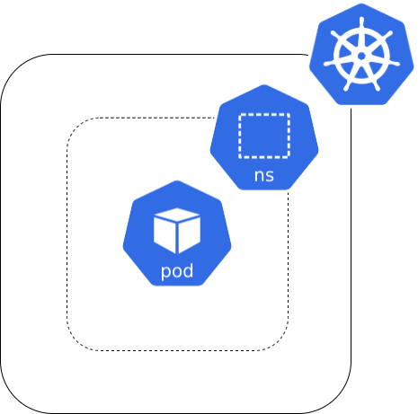

**Si besoin de revenir en arrière [⬅️](../00-intro/README.md)**

## Contexte 📖

J'ai préparé une image de conteneur pour le backend de mon application ! Et si on commençait par là ?  

Déployons un premier `Pod` dans le `namespace`.



## Concept 🎨

Un `Pod` est le plus petit objet que vous pouvez créer dans Kubernetes. Il a pour objectif d'exécuter les images de conteneurs correspondant aux composants de votre application.  

```yaml
apiVersion: v1
kind: Pod
metadata:
  name: appname
  labels:
    app: appname
spec:
  containers:
    - name: appname
      image: nginx:latest
      resources:
        requests:
          memory: "64Mi"
          cpu: "250m"
        limits:
          memory: "128Mi"
          cpu: "500m"
      ports:
        - containerPort: 80
```
La section `metadata` permet de définir le nom et les labels du `Pod`. Ces métadonnées permettent de catégoriser les `Pods`.  

La section `spec` permet de définir les conteneurs à exécuter dans le `Pod`. (en général, un seul conteneur applicatif par `Pod`)  
  * `name` : nom du conteneur
  * `image` : image à exécuter
  * `resources` : ressources allouées au conteneur 
    * section `limits` (obligatoire) : Permet la définition de la quantité maximale de ressources que Kubernetes pourra allouer au conteneur
    * section `requests` (fortement recommandé) : Permet la définition de la quantité nominale de ressources que le conteneur utilise. Ces valeurs permettent à Kubernetes de décider du noeud sur lequel placer le pod.
  * `ports` : ports exposés par le conteneur

## Cheat Sheet 📋

Astuce : taper `Pod` dans un fichier `.yaml` sur dans VS Code permet de récupérer un template.


## Pratique 👷

1) Créez un fichier `pod-backend.yaml` et créez un `Pod` : 
    * dans votre `namespace` (ex: `student-XX`)  
    * nommé `shop-backend`  
    * comportant le label `app: shop-backend-label`  
    * exécutant l'image `registry.gitlab.com/codelab-kubernetes/apps/shop-backend:no-database`  
    * allouant `32Mi` de mémoire et `50m` de CPU  
    * limitant la mémoire à `128Mi` et le CPU à `100m`  
    * exposant le port `8080`  


2) Déployer le `Pod`  
```shell
kubectl apply -f pod-backend.yaml
```

3) Vérifier le statut du `Pod`  
```shell
kubectl get pods
```

4) Récupérer les logs du `Pod`  
```shell
kubectl logs shop-backend
```

## Un bon début mais ça n'a pas l'air très robuste, en route vers le `Deployment` [➡️](../02-backend-deployment/README.md)
