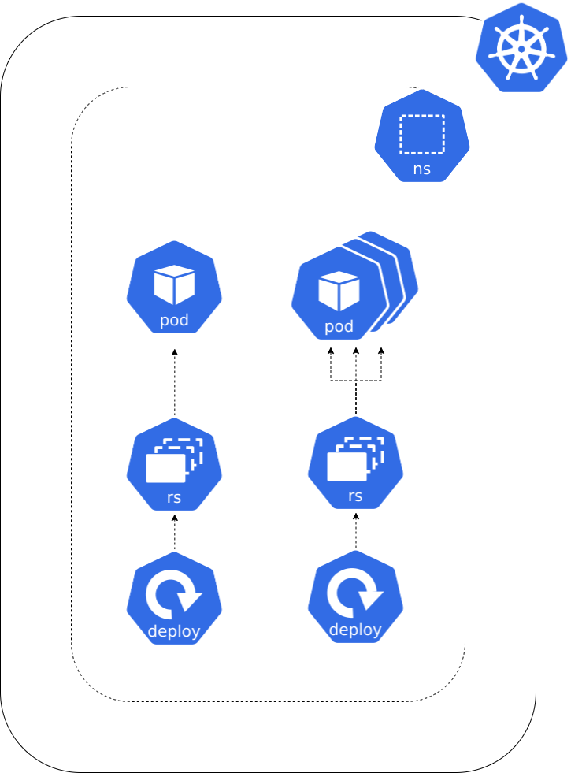

**Si besoin de revenir en arrière [⬅️](../02-backend-deployment/README.md)**

## Contexte 📖

Le backend, c'est bien, mais il faut bien un frontend pour que les utilisateurs puissent acheter nos produits et nous rendre riche !  

Et si on faisait la même chose pour le frontend ?  

Déployons notre frontend avec un second `Deployment` !  



## Pratique  👷

1) Créez un fichier `deploy-frontend.yaml` et créez un `Deployment` :
    * nommé `shop-frontend`
    * déployant 1 `Pod`
    * identifiés par le label `app: shop-frontend-label`
    * exécutant l'image `registry.gitlab.com/codelab-kubernetes/apps/shop-frontend:latest`
    * allouant `32Mi` de mémoire et `50m` de CPU
    * limitant la mémoire à `128Mi` et le CPU à `100m`
    * exposant le port `80`  


2) Déployer le `Deployment`
```shell
kubectl apply -f deploy-frontend.yaml
```

3) Vérifier le statut du `Deployment`
```shell
kubectl get deployments
```

4) Vérifier le statut des `Pods`
```shell
kubectl get pods
```

5) Vérifier les logs des `Pods` pilotés par le `Deployment`
```shell
kubectl logs deploy/shop-frontend
```

## Accédons au site ! [➡️](../04-exposition/README.md)
