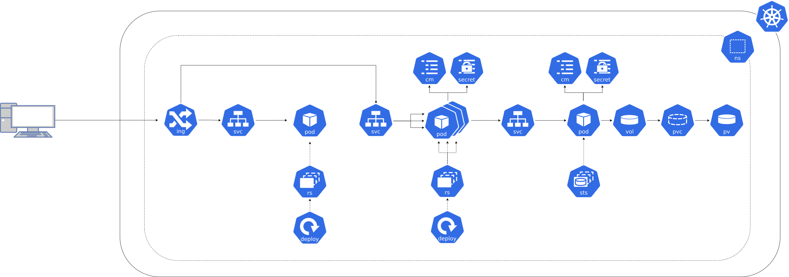
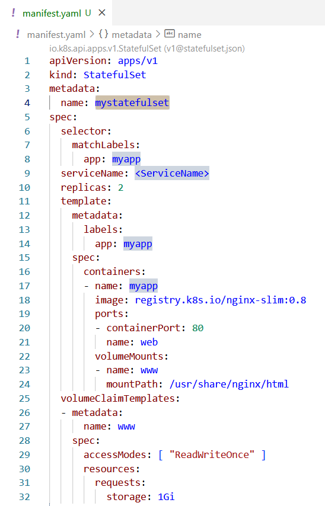

**Si besoin de revenir en arrière [⬅️](../04-exposition/README.md)**

## Contexte 📖

C'est super j'ai un site vitrine de déployé mais maintenant je veux utiliser ma base de données !  

Si j'ai bien compris on va tout faire pareil, on re-part sur un `Deployment` et un `Service` pour la base de données ? ❌  

Quand on a besoin de stocker de la donnée, on n'utilise pas de `Deployment` mais un `StatefulSet`.  

Avec un `StatefulSet` on va pouvoir gérer le stockage persistent des données en déclarant des `PersistentVolumeClaims` et des `PersistentVolumes`.  

On accède aux `Pods` du `StatefulSet` avec un `Service` **headless**, c'est à dire sans adresse IP, pour garantir un forwarding direct vers les `Pods`.  

On va également avoir besoin de gérer la configuration et le lien entre le backend et la base de données avec des `Secrets` et des `ConfigMaps`.  



## Concepts 🎨

Un `StatefulSet` est un objet Kubernetes qui permet de gérer un ensemble de `Pods` avec un ordre de déploiement et un nommage unique à travers les redéploiements.  
Il permet de gérer le stockage persistant des données avec des `PersistentVolumeClaims` et des `PersistentVolumes`.  

```yaml
apiVersion: apps/v1
kind: StatefulSet
metadata:
  name: appname
spec:
  selector:
    matchLabels:
      app: appname
  serviceName: appname
  replicas: 2
  template:
    metadata:
      labels:
        app: appname
    spec:
      containers:
      - name: appname
        image: nginx:latest
        ports:
        - containerPort: 80
        volumeMounts:
        - name: www
          mountPath: /usr/share/nginx/html
  volumeClaimTemplates:
  - metadata:
      name: www
    spec:
      accessModes: [ "ReadWriteOnce" ]
      resources:
        requests:
          storage: 1Gi
```

La section `metadata` permet de définir le nom du `StatefulSet`.  
La section `spec` permet de définir les caractéristiques du `StatefulSet` :  
  * `selector` : permet de définir quels `Pods` sont gérés par le `StatefulSet`.  
  * `serviceName` : permet de définir le nom du `Service` headless associé au `StatefulSet`, il doit exister avant la création du `StatefulSet`.    
  * `replicas` : nombre de `Pods` à exécuter (par défaut 1).  
  * `template` : permet de définir le template des `Pods` créés par le `StatefulSet`, cette section est équivalente à une définition de `Pod`.    
  * `volumeClaimTemplates` : permet de définir les `PersistentVolumeClaims` associés au `StatefulSet`.  

Un `PersistentVolumeClaim` est un objet Kubernetes qui permet de réserver un espace de stockage persistant pour un `Pod`.  
Il permet de définir la taille, le mode d'accès et le type de stockage.  
Il faut le monter dans le `Pod` avec un `volumeMount`. C'est l'équivalent du montage d'un disque dur pour un `Pod`.  

Un `Service` headless est un `Service` qui ne possède pas d'adresse IP, `clusterIP: None`.  

Une `ConfigMap` est un objet Kubernetes qui permet de stocker des données de configuration sous forme de clé/valeur.

```yaml
apiVersion: v1
kind: ConfigMap
metadata:
  name: appname
data:
  MY_KEY: "my-value"
```

Un `Secret` est un objet Kubernetes qui permet de stocker des données sensibles sous forme de clé/valeur. Très proche de la `ConfigMap` mais les données sont encodées en base64.  
La différentiation entre `Secret` et `ConfigMap` est pratique dans un contexte de sécurité, on peut donner accès aux `ConfigMaps` à des utilisateurs sans accès aux `Secrets`.    
Comme la valeur est encodée en base64, on utilise `stringData` pour définir les valeurs en clair.  

```yaml
apiVersion: v1
kind: Secret
metadata:
  name: appname
stringData:
  MY_SECRET_KEY: "my-secret-value"
```

Les `Secrets` et les `ConfigMaps` sont exploitables de différentes façons :  
  * injection dans les `Pods` avec des `envFrom` : injecte toutes les clés/valeurs en tant que variable d'environnement  
  * injection dans les `Pods` avec des `env` + `valueFrom` : injecte uniquement la valeur choisie, permet de redéfinir le nom de la clé  
  * montage dans les `Pods` avec des `volumeMounts` : monte les clés/valeurs en tant que fichier (clé = nom du fichier, valeur = contenu du fichier)  

Il est également possible de définir une variable d'environnement directement en spécifiant la clé et la valeur dans la section `env`.  

```yaml
apiVersion: v1
kind: Pod
...
spec:
  containers:
    - name: appname
      ...
      envFrom:
        - configMapRef:
            name: configmap-1
        - secretRef:
            name: secret-1
      env:
        - name: MY_INLINE_ENV_VAR
          value: "my-inline-value"
        - name: MY_ENV_VAR
          valueFrom:
            configMapKeyRef:
              name: configmap-2
              key: MY_KEY
        - name: MY_SECRET_ENV_VAR
          valueFrom:
            secretKeyRef:
              name: secret-2
              key: MY_SECRET_KEY
      volumeMounts:
        - mountPath: /etc/config
          name: configmap-volume
        - mountPath: /etc/secret
          name: secret-volume
      ...
  volumes: 
    - name: configmap-volume
      configMap:
        name: configmap-3
    - name: secret-volume
      secret:
        secretName: secret-3
```

## Cheat Sheet 📋

Astuce : taper `StatefulSet` dans un fichier `.yaml` sur dans VS Code permet de récupérer un template.




## Pratique 👷

1) Créer un fichier `database.yaml`, créez une `ConfigMap` :  
    * nommée `shop-database`  
    * contenant la clé `POSTGRES_DB` avec la valeur `shop`  

2) Dans le fichier `database.yaml`, créez un `Secret` :  
    * nommé `shop-database`  
    * contenant la clé `POSTGRES_PASSWORD` avec la valeur `shop`  

3) Dans le fichier `database.yaml` et créez un `StatefulSet` :  
    * nommé `shop-database`  
    * comportant le label `app: shop-database`  
    * utilisant le `Service` headless `shop-database`
    * déployant 1 `Pod`  
    * identifié par le label `app: shop-database`  
    * exécutant l'image `registry.gitlab.com/codelab-kubernetes/apps/shop-database:latest`  
    * allouant `64Mi` de mémoire et `100m` de CPU  
    * limitant la mémoire à `256Mi` et le CPU à `500m`  
    * exposant le port `5432`  
    * injectant toute la `ConfigMap` `shop-database` en tant que variables d'environnement
    * injectant tout le `Secret` `shop-database` en tant que variables d'environnement
    * déclarant un `PersistentVolumeClaim` nommé `postgres-data` de `1Gi` en `ReadWriteOnce`  
    * déclarant un `volumeMount` nommé `postgres-data` monté dans `/var/lib/postgresql/data` en specifiant le `subPath: postgres`  

4) Dans le fichier `database.yaml` créez un `Service` headless : 
    * nommé `shop-database`  
    * ciblant les `Pods` identifiés par le label `app: shop-database`  
    * exposant le port `5432` du `Pod` sur le port `5432` du `Service`


5) Déployez la base de données 
```shell
kubectl apply -f database.yaml
```

6) Vérifiez le statut des ressources déployées
```shell
kubectl get statefulsets
kubectl get pods
kubectl get svc
kubectl get pvc
kubectl logs shop-database-0
```

7) Reprennez votre précédente déclaration du `Deployment` `shop-backend` dans un fichier `backend.yaml`

8) Dans le fichier `backend.yaml` :  
  * Spécifiez l'image `registry.gitlab.com/codelab-kubernetes/apps/shop-backend:database`
  * Ajoutez la variable d'environnement inline `SPRING_R2DBC_URL=r2dbc:postgresql://shop-database:5432/shop`  
  * Ajouter la variable d'environnement `SPRING_R2DBC_PASSWORD` à partir de la clé `POSTGRES_PASSWORD` du `Secret` `shop-database`

9) Re-déployez le backend
```shell
kubectl apply -f backend.yaml
```

10) Vérifiez le statut des ressources déployées
```shell
kubectl get deployments
kubectl get pods
kubectl logs deploy/shop-backend
```

11) Testez l'accès à l'application depuis un navigateur : `https://<student-X>.devshop.codelab.dwidwi.tech/` (remplacer `<student-X>` par votre identifiant de participant)  

## C'est bon, on a notre application complète, mais est-ce que ça tiendra la charge ? [➡️](../06-backend-autoscaler/README.md)
